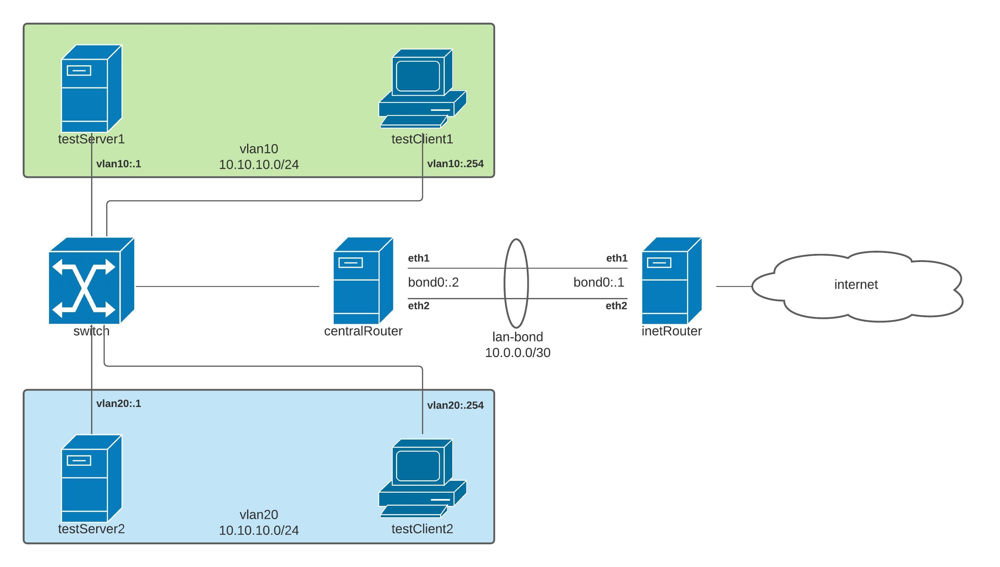
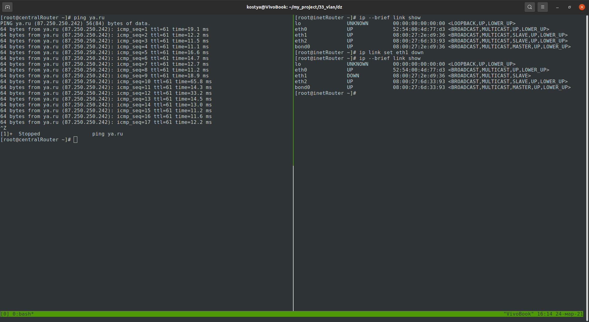

Стенд для настройки VLAN & LACP.
================================

Цель:

Строим бонды и вланы

в Office1 в тестовой подсети появляется сервера с доп интерфесами и адресами в internal сети testLAN

testClient1 - 10.10.10.254
testClient2 - 10.10.10.254
testServer1- 10.10.10.1
testServer2- 10.10.10.1
равести вланами testClient1 <-> testServer1 testClient2 <-> testServer2

между centralRouter и inetRouter "пробросить" 2 линка (общая inernal сеть) и объединить их в бонд проверить работу c отключением интерфейсов

Реализация.
-----------


VLAN
----

Настроим vlan интерфейсы testClient1 <-> testServer1 testClient2 <-> testServer2.

<details>
  <summary>testClient1</summary>

```
[root@testClient1 ~]# cat /etc/sysconfig/network-scripts/ifcfg-vlan10

ONBOOT=yes
TYPE=Vlan
VLAN=yes
VLAN_NAME_TYPE=VLAN_PLUS_VID_NO_PAD
DEVICE=vlan10
PHYSDEV=eth1
VLAN_ID=10
BOOTPROTO=static
IPADDR=10.10.10.254
NETMASK=255.255.255.0
```
</details>

<details>
  <summary>testServer1</summary>

```
[root@testServer1 ~]# cat /etc/sysconfig/network-scripts/ifcfg-vlan10

ONBOOT=yes
TYPE=Vlan
VLAN=yes
VLAN_NAME_TYPE=VLAN_PLUS_VID_NO_PAD
DEVICE=vlan10
PHYSDEV=eth1
VLAN_ID=10
BOOTPROTO=static
IPADDR=10.10.10.1
NETMASK=255.255.255.0

```
</details>

<details>
  <summary>testClient2</summary>

```
[root@testClient2 ~]# cat /etc/sysconfig/network-scripts/ifcfg-vlan20 

ONBOOT=yes
TYPE=Vlan
VLAN=yes
VLAN_NAME_TYPE=VLAN_PLUS_VID_NO_PAD
DEVICE=vlan20
PHYSDEV=eth1
VLAN_ID=20
BOOTPROTO=static
IPADDR=10.10.10.254
NETMASK=255.255.255.0
```
</details>

<details>
  <summary>testServer2</summary>

```
[root@testServer2 ~]# cat /etc/sysconfig/network-scripts/ifcfg-vlan20

ONBOOT=yes
TYPE=Vlan
VLAN=yes
VLAN_NAME_TYPE=VLAN_PLUS_VID_NO_PAD
DEVICE=vlan20
PHYSDEV=eth1
VLAN_ID=20
BOOTPROTO=static
IPADDR=10.10.10.1
NETMASK=255.255.255.0
```
</details>

Разделенная локальная сеть, не конфлектует между собой.

LACP
----

Для проверки отключим один из интерфейсов и убедимся, что доступ к хосту не изменилась.



